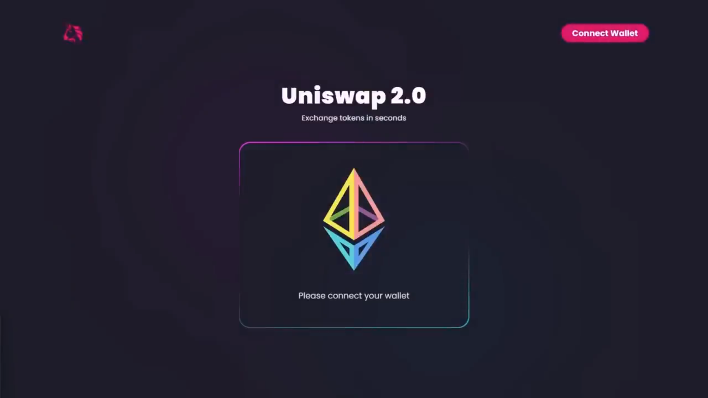

# Building and Deploying a Modern Crypto Exchange Uniswap dApp and Master Web3 Development & Smart Contracts




Welcome to the future of decentralized finance (DeFi) where innovation meets opportunity. In this project, we'll embark on an exciting journey to create and deploy a cutting-edge crypto exchange platform inspired by the renowned Uniswap.

Our mission is to build a Web3 Uniswap dApp using React, empowering users with seamless Metamask integration for secure wallet pairing. With live smart contract data fetching, participants can stay updated in real-time while exploring the transformative capabilities of creating and swapping custom ERC20 tokens.

### Getting Started
To clone and run the application locally, follow these steps:

1. Clone the repository:
   ```bash
   git clone https://github.com/CodexEmmzy/UniswapWeb3
   ```

2. Navigate to the project directory:
   ```bash
   cd UniswapWeb3
   ```

3. Install dependencies:
   ```bash
   npm install
   ```

4. Run the development server:
   ```bash
   npm run react-app:start
   ```

5. Open your browser and navigate to [http://localhost:3000](http://localhost:3000) to view the application.

### Project Structure
```
UniswapWeb3/
├── contracts/
│   ├── src/
│   ├── package.json
│   └── README.md
├── packages/
│   ├── contracts/
│   └── react-app/
├── src/
│   ├── assets/
│   ├── styles/
│   ├── utils/
│   └── ...
├── README.md
├── package.json
├── final_checkpoint.cranqj
└── checkpoint_one.cranqqj
```

### Contributing
Contributions are welcome! Feel free to open issues and pull requests to suggest improvements or new features.
